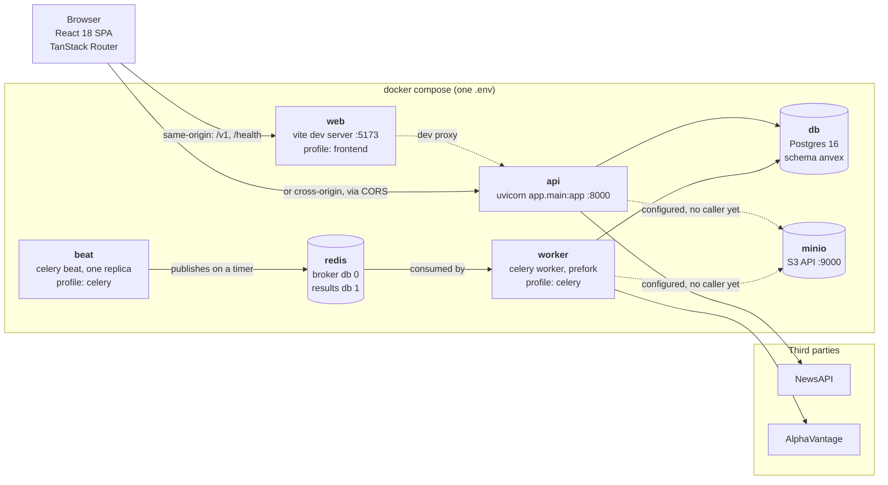
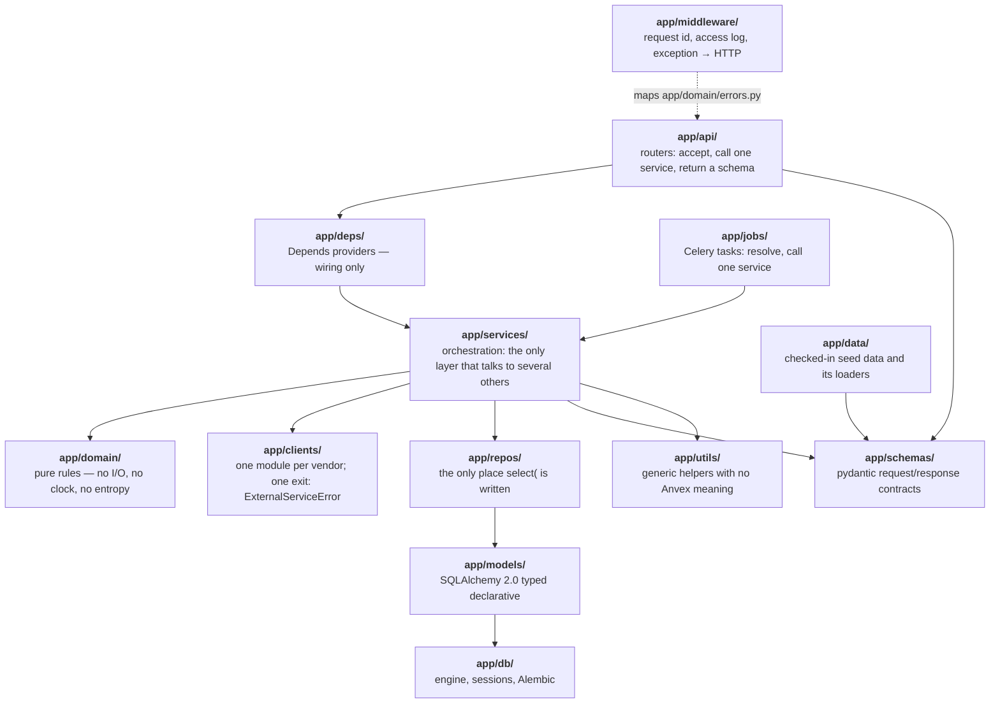
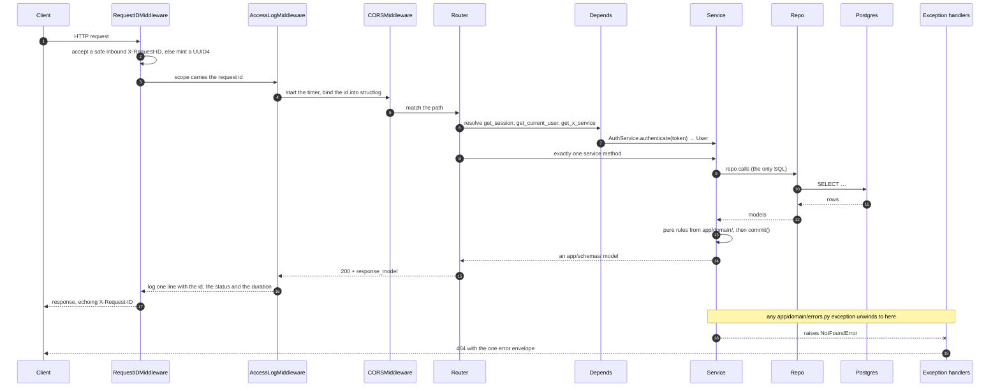
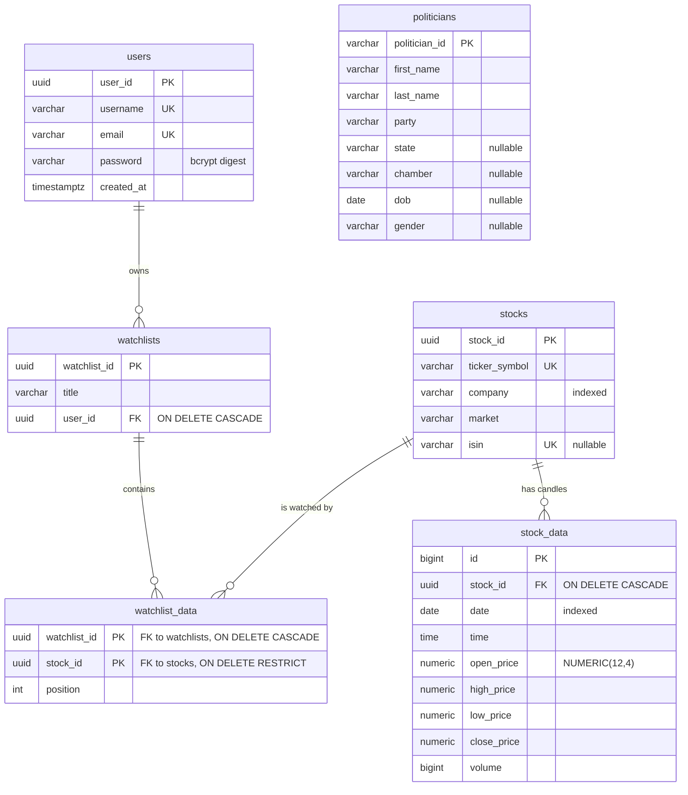

# Anvex architecture

What the system is made of, how a request travels through it, how a scheduled job travels
through it, and what is actually stored. Every path, route and marker named below is
asserted against the code by `backend/tests/unit/test_docs.py` — if this file drifts from
the repository, the backend suite fails.

| Read | For |
| --- | --- |
| this file | the shape of the system, the two paths through it, and the data model |
| [`../CLAUDE.md`](../CLAUDE.md) | the layering contract — the rules, and the arguments for them |
| [`adr/`](./adr/) | the decisions, with the context and the costs as they actually were |
| [`../backend/docs/adding-an-endpoint.md`](../backend/docs/adding-an-endpoint.md) | one real feature through all seven layers |
| [`../backend/docs/runbook.md`](../backend/docs/runbook.md) | starting it, migrating it, seeding it, and what breaks |
| [`../backend/docs/testing.md`](../backend/docs/testing.md) | the test tiers and the harness |
| [`aws-deployment.md`](./aws-deployment.md) | the deploy path that has never been run, and its cost |

---

## 1. The system

Everything runs under one `docker-compose.yml`, reading one repo-root `.env`. There is no
second environment file and no per-stack config file.



Two of those arrows are dashed on purpose. `S3_ENDPOINT_URL` is set for `api` and `worker`
and `app/deps/storage.py` builds a `StorageService` for a request — but **no router mounts
it**, so nothing in the running application reads or writes an object today. MinIO exists
for the storage tier of the test suite and for the day a route needs it. Likewise the API
process never opens a Redis connection: only `beat` publishes and only `worker` consumes.

| Service | Image | Profile | Published on | Purpose |
| --- | --- | --- | --- | --- |
| `db` | `postgres:16-alpine` | default | `POSTGRES_HOST_PORT` (5442) | the application database, named volume |
| `db-test` | `postgres:16-alpine` | default | `POSTGRES_TEST_HOST_PORT` (5433) | the only database a test may write to; tmpfs, empty every start |
| `redis` | `redis:7-alpine` | default | `REDIS_HOST_PORT` | Celery broker (db 0) and result backend (db 1) |
| `minio` | `minio/minio` | default | `MINIO_HOST_PORT` | S3-compatible object store |
| `minio-init` | `minio/mc` | default | — | creates the bucket, then exits |
| `api` | `anvex/api:dev` | default | `API_HOST_PORT` (8000) | the HTTP API |
| `worker` | `anvex/api:dev` | `celery` | — | consumes tasks |
| `beat` | `anvex/api:dev` | `celery` | — | publishes the schedule |
| `web` | `anvex/web:dev` | `frontend` | `WEB_HOST_PORT` (5173) | Vite dev server, and where every npm command runs |

The compose service names *are* the in-network hostnames the settings default to
(`app/settings.py`), so renaming a service is a configuration change. Published host ports
are a developer convenience and live in `.env`; port **5442**, not 5432, because a natively
installed Postgres owns 5432 on the development machine and on Windows both it and Docker's
proxy bind successfully — a host client silently reaches the wrong server with no error.

### The backend's layers

Dependencies flow **downward only**. A layer may import from layers below it, never above,
and the rule is enforced by an AST sweep in `backend/tests/unit/test_clients_base.py`
rather than by this diagram.



Each folder's single job, and the arguments for every rule in it, are in
[`../CLAUDE.md`](../CLAUDE.md) §3. The short version:

- `app/api/` may not query, call a vendor, or hold a business rule.
- `app/domain/` may not do I/O — no database, no HTTP, no clock read, no `uuid4()`. Time
  and entropy arrive as required keyword arguments.
- `app/repos/` is the only place `select(` appears, and a repo never commits.
- `app/services/` owns the transaction, the error vocabulary and the clock read.
- `app/clients/` knows one vendor and nothing about Anvex, and leaves by exactly one
  exception.

---

## 2. The request path

`GET /v1/watchlists/{watchlist_id}` with a bearer token, end to end.



Middleware is registered CORS-first in `app/middleware/setup.py`, and Starlette reverses
registration order, so the **request id is outermost** — every log line and every error body
can quote it, including one produced before routing.

### The error envelope

Every non-2xx response uses one shape, from `backend/app/schemas/errors.py`. That includes
a domain error, a pydantic 422, an unknown-route 404, a 405, and an unhandled crash.

```json
{
  "error": {
    "code": "not_found",
    "message": "stock 'AAPL' was not found.",
    "details": {"resource": "stock", "identifier": "AAPL"},
    "request_id": "8f1c…"
  }
}
```

All four keys are always present, and **`details` is `{}` rather than `null`**, so a client
indexes it unconditionally. **Branch on `code`, never on `message`** — the messages are
prose and get reworded. A 500 always returns the fixed text `An unexpected error occurred.`
with empty `details`; the traceback is logged and never returned.

The mapping lives in `backend/app/middleware/errors.py` and is the public contract:

| Exception (`app/domain/errors.py`) | Status | `code` |
| --- | --- | --- |
| `AnvexError` | 500 | `internal_error` |
| `ValidationError` | 422 | `validation_error` |
| `UnauthorizedError` | 401 | `unauthorized` |
| `ForbiddenError` | 403 | `forbidden` |
| `NotFoundError` | 404 | `not_found` |
| `ConflictError` | 409 | `conflict` |
| `ExternalServiceError` | 502 | `external_service_error` |

502 rather than 503 for a vendor failure: *we* are up, the thing behind us is not.

Token failures are `UnauthorizedError` subclasses in `backend/app/domain/auth.py` with
their own codes — `invalid_token`, `token_expired`, `wrong_token_type` — which is what lets
a client refresh on expiry and sign out otherwise without learning *why* a signature failed.

Two `details` payloads are worth knowing about because a client acts on them:

- A registration 409 carries `details.field` (`username` or `email`), so a sign-up form can
  put the message on the control that has to change. Registration is the one deliberate
  exception to "an endpoint keyed on an unauthenticated identifier answers identically
  whether or not it exists".
- A registration 422 for a weak password carries
  `details.failed_rules` — a list drawn from `("length", "uppercase", "number", "symbol")`,
  in that fixed order. It is the **first non-scalar `details` value in the API**, and it
  exists so a client can light up its own per-rule lines instead of one opaque banner. The
  rules themselves live in `backend/app/domain/password.py`, and
  `backend/tests/unit/test_domain_password.py` parses
  `frontend/src/features/auth/components/SignUpPage.jsx` so the client and server
  definitions cannot drift.

### Pagination

Every list returns `Page[T]` from `backend/app/schemas/pagination.py` — never a bare array,
because an array cannot gain a key later without breaking every client.

```json
{"items": [], "total": 0, "limit": 50, "offset": 0, "has_more": false}
```

`total` is counted **before** the window, so an offset past the end is an empty page with a
truthful total rather than an implied end of the collection. The ceiling is guarded twice
and the two are not redundant: the route's `Query(ge=1, le=MAX_PAGE_LIMIT)` **refuses** an
over-large limit with a 422 so an HTTP client is never quietly handed a shorter page than it
asked for, while the service's clamp protects callers with no request to reject — a Celery
task, a seed script.

### Wire-format facts that are easy to get wrong

- **Prices are quoted JSON strings** (`"1234.5678"`), not numbers. `Decimal` end to end is
  what preserves the fourth decimal place; a JSON number goes through a float and loses it.
  A client must `Number()` them, and `"10.2" < "9.5"` is `true`, so an unconverted series
  produces a confidently inverted price axis on a chart that draws perfectly well.
- **`stock_data`'s `datetime` is naive on purpose** — no `Z`, no offset. It is the
  exchange's local clock, and stamping UTC onto 09:30 ET would move every candle. It is the
  one datetime in the API without an offset, and `backend/app/schemas/stock_data.py` says so
  in its own docstring. Read it back with UTC getters against a nominal epoch; do not
  "fix" it.
- **Refresh is single-flight and triggers on 401, not 403.** `POST /v1/auth/refresh` takes
  a **JSON body**, not a query parameter, and it rotates: the token presented is invalidated,
  so N concurrent refreshes mean N−1 spent tokens and a spurious sign-out.
- **The access token lives in memory only**, and nothing ever persists a password.

### The API surface

Twenty-four operations. This table is compared against the live OpenAPI document in both
directions by `backend/tests/unit/test_docs.py`, so a route added without a line here — or a
line here naming a route that does not exist — fails the backend suite.

| Method | Path | What it does |
| --- | --- | --- |
| `GET` | `/health` | Liveness. No I/O at all, which is why it is the container healthcheck. |
| `GET` | `/health/ready` | Readiness. Real `SELECT 1`; 503 when the database is unreachable. |
| `POST` | `/v1/auth/login` | Form-encoded (`OAuth2PasswordRequestForm`) → a `TokenPair`. |
| `POST` | `/v1/auth/refresh` | JSON body. Rotates the pair and invalidates the token presented. |
| `POST` | `/v1/auth/recovery` | Always 202, identical body for every username. Nothing is delivered. |
| `POST` | `/v1/users` | Register. 409 names `details.field`; 422 names `details.failed_rules`. |
| `GET` | `/v1/users/me` | The signed-in account. Declared before `/{user_id}`. |
| `GET` | `/v1/users/{user_id}` | Somebody else's id is a 404, not a 403. |
| `GET` | `/v1/stocks` | `Page[StockOut]`, optionally searched. |
| `GET` | `/v1/stocks/{stock_id}` | One security by id. |
| `GET` | `/v1/stocks/by-ticker/{ticker}` | One security by ticker; the service canonicalises the symbol. |
| `GET` | `/v1/stocks/{stock_id}/data` | That security's candles, `Page[StockDataPoint]`. |
| `GET` | `/v1/stocks/by-ticker/{ticker}/data` | The same collection, reached the other way. |
| `GET` | `/v1/watchlists` | Your own watchlists. There is no id to substitute. |
| `POST` | `/v1/watchlists` | Create one. The body carries a title and nothing else. |
| `GET` | `/v1/watchlists/{watchlist_id}` | With its stocks already in `position` order. Empty is a 200. |
| `DELETE` | `/v1/watchlists/{watchlist_id}` | Deletes the memberships with it; the securities are untouched. |
| `POST` | `/v1/watchlists/{watchlist_id}/stocks` | Add a stock. Omit `position` to append. |
| `DELETE` | `/v1/watchlists/{watchlist_id}/stocks/{stock_id}` | Remove one and close the gap. |
| `PATCH` | `/v1/watchlists/{watchlist_id}/stocks/{stock_id}` | Move one; returns the whole reordered list. |
| `GET` | `/v1/politicians` | Reference data from `backend/app/data/politicians.json`. |
| `GET` | `/v1/politicians/{politician_id}` | One legislator by roster id. |
| `GET` | `/v1/news/top` | Served entirely from NewsAPI. Nothing is persisted. |
| `GET` | `/v1/news/by-symbol/{ticker}` | The ticker is resolved locally **first** — see below. |

`/v1/news/by-symbol/{ticker}` resolves the symbol against `stocks` before calling the
vendor, and the local row earns its keep three times over: NewsAPI answers a nonsense symbol
with `{"status": "ok", "totalResults": 0}`, byte-identical to a real company nobody wrote
about this week, so only the local table can tell a typo from a quiet week; it stops a
metered quota being spent on garbage; and the row carries the company name, so
`q="CAT" OR "Caterpillar Inc."` is a materially better query than `q="CAT"`, which returns
articles about cats.

---

## 3. The job path

The scheduled intraday ingest, which is the only real job. `beat` publishes a dispatcher on
a timer, the dispatcher asks a service for a plan and publishes one message per vendor call,
and each of those makes exactly one call.

```mermaid
sequenceDiagram
    autonumber
    participant B as beat
    participant K as Redis broker
    participant W as worker
    participant RA as run_async
    participant SV as IngestService
    participant AV as AlphaVantage
    participant PG as Postgres

    B->>K: jobs.ingest.ingest_all, expires = interval − 600s
    K->>W: deliver
    W->>RA: run_async(lambda: _ingest_all())
    RA->>SV: IngestService.plan()
    SV->>PG: which securities, and how far behind is each
    SV-->>RA: targets, ordered, with a per-message countdown
    loop one message per vendor call
        RA->>K: jobs.ingest.ingest_symbol(ticker, month)<br/>countdown = i × 15s, expires = countdown + 600s
    end
    RA-->>W: a report; the fan-out made no vendor call itself

    K->>W: deliver one target, after its countdown
    W->>RA: run_async(lambda: _ingest_symbol(...))
    RA->>SV: IngestService.ingest_month(ticker=…, month=…)
    SV->>AV: one TIME_SERIES_INTRADAY call
    AV-->>SV: candles, parsed straight from strings into Decimal
    SV->>SV: app/domain/ingest.py — session window, watermark, quantise, dedupe
    SV->>PG: INSERT … ON CONFLICT DO UPDATE
    SV-->>RA: an IngestReport
    RA->>PG: dispose_engine() inside the same loop, before it closes
```

Five properties hold that pipeline together, and each one is asserted somewhere in
`backend/tests/unit/test_jobs_celery_app.py`, `backend/tests/unit/test_jobs_base.py` or
`backend/tests/unit/test_jobs_ingest.py`:

- **`run_async` is the one bridge.** Celery runs a task synchronously and the rest of the
  backend is `async`; exactly one module reconciles that. Every task is a two-function pair:
  a sync entry point containing nothing but the bridge call, and an `async` half that
  resolves its collaborators and calls **one** service — the API handler's rule, for the API
  handler's reason, so a route and a job share the service. `run_async` takes a **factory,
  not a coroutine**, because building the coroutine outside the loop that is about to exist
  is the mistake; passing one is a `TypeError` with the fix in the message.
- **A pooled connection must not outlive its loop.** `run_async` creates a loop, runs the
  work, and calls `dispose_engine()` *inside* that loop before closing it. The accepted cost
  is stated rather than discovered: a worker gets **no cross-task connection pooling** and
  pays one Postgres connect per task. That is the right trade while a task is a batch, and
  the trigger to revisit it is a measurement — a task whose own runtime approaches the
  connect cost, or a queue of many short tasks per second.
- **A fork is handled in the child, synchronously, without closing anything.**
  `reset_engine()` is wired to Celery's `worker_process_init`; it swaps in an empty pool via
  `sync_engine.dispose(close=False)` and forgets the engine. It is deliberately not a
  coroutine (a just-forked child has no loop) and it deliberately does not close (those
  descriptors are still the parent's).
- **A metered vendor is paced by a `countdown`, never by a sleep.** The unit of work is one
  vendor call, so the spacing paces calls rather than batches. A countdown costs nothing
  because the work does not exist yet. This is *pacing*, not rate limiting — nothing counts
  calls, so `MAX_CALLS_PER_RUN × CALL_SPACING_SECONDS` must stay inside the beat interval,
  and a test asserts that inequality because nothing else would notice until the roster grew.
- **At-least-once, with a deliberate asymmetry.** `task_acks_late=True` with
  `task_reject_on_worker_lost=False`. A lost *connection* is the network's fault and
  redelivery is free; a lost *process* is very often the message's fault — the task that
  OOMed will OOM again, and redelivering it kills every worker that picks it up. Lose the
  run, keep the workers; beat re-drives on the next tick. Every beat entry therefore carries
  an `expires` shorter than its own interval, so a queue nobody is draining holds at most one
  pending run instead of replaying hours of stale ticks when the workers come back.

The schedule, from `backend/app/jobs/celery_app.py`:

| Slug | Task | Every | `expires` |
| --- | --- | --- | --- |
| `health-ping` | `jobs.health.ping` | 5 minutes | interval − 60s |
| `ingest-intraday` | `jobs.ingest.ingest_all` | 1 hour | interval − 600s |

Every task passes an explicit `name="jobs.<module>.<function>"`, because Celery's default is
the dotted import path and renaming a module would orphan every message already queued. A
sweep asserts the convention across the registry, and a second sweep derives the worker's
import list from the contents of `backend/app/jobs/`, so a new job module that is not
registered fails the suite instead of silently never running.

---

## 4. The data model

Six tables, all in the `anvex` Postgres schema, all created by Alembic — there is no
`Base.metadata.create_all` outside tests.



`politicians` stands alone: it is reference data loaded from
`backend/app/data/politicians.json` by the seed script, with no relationship to anything
else yet.

Six decisions in there are worth stating rather than inferring:

- **Every foreign key states its `ondelete`.** Omitting it is a decision by default —
  the dependent rows simply block the parent's deletion. `CASCADE` where the child is *part
  of* the parent (a candle, a membership row); `RESTRICT` where the parent is reference data
  somebody depends on. Deleting a security people are actively watching is a mistake worth
  surfacing, so `watchlist_data.stock_id` restricts while `watchlist_data.watchlist_id`
  cascades. Each is mirrored on the relationship with `passive_deletes`, or the ORM loads the
  children and tries to rewrite them first.
- **`watchlist_data`'s composite primary key is real.** The predecessor declared
  `__mapper_args__ = {"primary_key": [...]}`, which only told the ORM what to *treat* as a
  key — the table itself had none, so nothing stopped the same stock being added twice.
- **`watchlist_data.position` is deliberately not unique.** A swap's intermediate state has
  to be legal, and a non-deferrable unique constraint would reject it. Correctness comes from
  renumbering the whole list on every mutation instead (`backend/app/domain/watchlist.py`),
  which is also what makes the rule right when the stored ordinals have drifted.
- **`stock_data` splits `date` and `time` rather than storing a timestamp**, and the pair is
  unique per `stock_id`. That composite unique constraint is what makes the ingest's
  `INSERT … ON CONFLICT DO UPDATE` idempotent. The API recombines the two into one naive
  `datetime` for output.
- **Prices are `NUMERIC(12,4)`, never a float**, and the scale is a constant in
  `backend/app/models/stock.py` that `backend/app/domain/ingest.py` imports so a widened
  column cannot leave a stale `4` behind. Rounding is `ROUND_HALF_UP`, not Python's banker's
  default, so a `SELECT` after the `INSERT` agrees with the job that wrote it.
- **Constraint names come from a naming convention on `Base.metadata`** (`pk_` / `fk_` /
  `uq_` / `ix_` / `ck_`), so Postgres never invents a name Alembic cannot reproduce — and so
  a service catching an `IntegrityError` can match on a deterministic
  `uq_<table>_<column>` rather than on a message.

### Object storage

There is no second database. S3 (MinIO locally) holds exports, keyed by
`backend/app/domain/storage.py`:

```
exports/{resource}/{owner_id}/{YYYY}/{MM}/{DD}/{slug}-{token}.{ext}
```

The prefix is `EXPORTS_PREFIX`, retention is `EXPORT_RETENTION` (30 days), and the
Terraform lifecycle rule filters on the same two constants rather than on a copy of them.
The uniqueness token is a **required argument**, not a `uuid4()` inside the function, for
the same reason the clock is: a domain function whose output depends on something it was not
given cannot be tested against a whole expected value.

---

## 5. The frontend

```
frontend/src/
├── routes/       # one module per route + tree.js; guards live in beforeLoad
├── features/     # one folder per domain area, with a pure half where there is an algorithm
├── components/   # shared presentational components only
├── lib/          # the api transport, env config, the router factory
├── hooks/        # cross-feature hooks
├── providers/    # auth, theme, errors
└── test/         # the one setup file and the one MSW server
```

Eight routes, from `frontend/src/routes/paths.js`: `/`, `/login`, `/signup`, `/recovery`,
`/unauthorized`, `/research`, `/portfolio`, and a 404 for anything else. `/research` and
`/portfolio` are guarded; the rest are public, including the 404 — guarding it would make
"sign in first" versus "not found" an oracle for which paths exist.

Three properties are load-bearing and each has a test that fails without it:

- **Guarding happens in `beforeLoad`, not in a rendered wrapper.** A route *element* that
  reads the session and returns a redirect has already entered the protected branch: the
  loader ran, the component mounted, its effects fired a protected request, and a second
  render unwinds it. `beforeLoad` runs while the navigation is being resolved, so a refusal
  renders nothing and requests nothing.
- **Refresh is single-flight, and the promise is the queue.** One module-level
  `refreshInFlight` in `frontend/src/lib/api/client.js`; every request that 401s while it is
  running awaits that same promise and replays itself with the token it resolves to.
- **Only a refusal ends the session.** The tokens are cleared when the refresh comes back
  4xx, or when a 401 arrives with a code refreshing cannot fix. A network failure or a 5xx
  during refresh keeps them — signing a user out because their connection blipped discards
  credentials that are still valid.

---

## 6. Known limitations

These are decisions and gaps, not bugs, and they are written down so the first reader does
not file them. Where a limitation is tracked by a marker in the source, the marker is in the
last column and `backend/tests/unit/test_docs.py` asserts it is still there — and asserts,
in the other direction, that every `TODO(ANV-…)` under `backend/app/` and `backend/infra/`
appears in this table.

| What | Where | Marker |
| --- | --- | --- |
| **`/portfolio` is a documented non-feature, not a bug.** There is no holdings model, no positions table, no cost basis, no quantity and no quote anywhere in the API, so the page says so instead of rendering an empty table whose column headers describe a product that does not exist. | `frontend/src/features/portfolio/components/PortfolioPage.jsx` | — |
| **The research desktop's window arrangement does not survive a reload**, and it is the highest-value follow-up on that page. Persisting it is not one line: `localStorage` is per-browser and per-device, and there is no API endpoint for a layout — the decision about *where* has to come first. | `frontend/src/features/research/components/ResearchPage.jsx` | — |
| **There is no mail client.** `POST /v1/auth/recovery` looks the account up, logs `delivered=False` and returns 202 with a fixed body. Nothing is sent. A unit test asserts the marker is still present, so it fails the moment real delivery lands and the note stops being true. | `backend/app/services/auth.py` | `TODO(ANV-mail)` |
| **There is no deep historical backfill.** `IngestService.ingest_month` takes an explicit month and does it correctly, but nothing infers a gap older than the watermark — closing one means dispatching months by hand. The predecessor's 43-month sweep is the thing that was not ported. | `backend/app/services/ingest.py` | — |
| **`StorageService.download_url` exists and no route mounts it.** Whether a presigned URL — whose query string *is* a credential until it expires — should ever leave the API is an open decision, not an oversight. The same is true of the rest of `StorageService`: `app/deps/storage.py` builds one, and no router asks for it. | `backend/app/services/storage.py` | — |
| **`S3Client` cannot talk to real AWS S3.** Two individually correct properties combine badly: `Settings.s3_endpoint_url` defaults to the MinIO URL so it cannot be unset by omitting the variable, `""` is not `None` to botocore, and `_require_configuration` refuses a blank key pair on purpose (otherwise botocore falls back to the ambient credential chain and quietly writes to a real bucket). The fix is a small application change, after which the Terraform's IAM user and its secret are deleted. | `backend/infra/modules/compute/locals.tf` | `TODO(ANV-s3-aws)` |
| **Nothing uses TLS to Postgres or Redis.** `Settings` builds a plain `postgresql+asyncpg://` and a plain `redis://`, so enabling `rds.force_ssl` or `transit_encryption_enabled` on its own would refuse every connection. Both halves have to move together. | `backend/app/settings.py` | — |
| **The MinIO/S3 test tier — 14 tests — skips in CI.** A GitHub service container can override an entrypoint but cannot pass an argument, and `minio/minio` needs `server /data`. An image with a default command, or a `docker run` step in a smoke job, are the two ways back; both are decisions rather than fixes. It runs locally, and the suite says which tier skipped and why. | `.github/workflows/ci.yml` | — |
| **Cosmetic issues in the ported marketing and research copy are deliberate.** `Features` carries `sm:1/2` (a typo for `sm:w-1/2`, so not a Tailwind class at all), only `Pricing`'s middle card has `h-full`, `Footer`'s border has no light variant, and two of `Workflow`'s paragraphs still say "AverageInvestor". They are the page owner's, each one changes the appearance, and a port that quietly improves the wording is a port nobody can review against the original. | `frontend/src/features/home/components/Workflow.jsx` | — |
| **Nothing has ever been deployed.** `backend/infra/` is `terraform validate`-clean and has never been applied; no AWS account has been touched and the running cost is $0.00. | `docs/aws-deployment.md` | — |

---

## 7. Where the decisions are written down

`docs/adr/` holds one record per decision, with the context and the consequences as they
actually were. Start at [`adr/README.md`](./adr/README.md).
